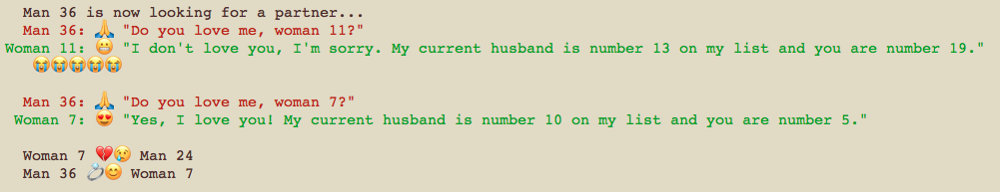

# stable-marriage
Node.js implementation of the Stable Marriage Problem (SMP).
Generates a random instance of the problem (default
size: 20 persons of each gender) and solves it using the
 [Gale-Shapley algorithm](https://en.wikipedia.org/wiki/Stable_marriage_problem#Algorithm).

The script logs the process of matching partners in a
dialogue-style manner, for presenting it to an audience
and, well, for the funsies. Like this:



## Remark

I am very well aware of how stereotypical the man/woman
terminology is. The SMP has been known for decades, and
well, times were different. For reasons of clear data
structuring and because the problem is best known under
the man/woman couple analogy, I stick to the outmoded
labels, whilst strongly supporting diversity in any
way. <3

## Usage

Start the script by hitting `npm start` in the project directory.

If you don't pass any arguments, the script will generate
a random SMP instance of size n=20.

### Generating a random instance of size n

You can adjust the default size by passing an optional
argument `n=<size>`, where `<size>` is the number of
couples to be generated. For example

```
$ npm start n=25
```

will generate an instance with 25 women and 25 men, each
of them having their own priority list with 25 entries,
resulting in 25 couples.

**Careful!** Time complexity of the current
implementation is exponential. I'd recommend not using
any n > 400.

### Passing a specific instance via a JSON file

If you want to precisely specify the instance to be
matched, you can define it in a separate .json file and
pass it to the script via the argument `f=<path-to-json>`,
where `<path-to-json>` is the relative path from the entry
point of your script (usually the `stable-marriage/` folder).

The .json file must match the following structure:

```
{
  "men": {
    <m1>: [ <wx>, <wy>, ... ],
    <m2>: ...,
    ...
  },
  "women": {
    <w1>: [ <mx>, <my>, ... ],
    <w2>: ...,
    ...
  }
}
```

where

- `<m1>`, `<m2>`, ... are IDs of men
- `<w1>`, `<w2>`, ... are IDs of women
- `[ <wx>, <wy>, ... ]` are priority lists consisting of women's IDs
- `[ <mx>, <my>, ... ]` are priority lists consisting of men's IDs.

Naturally, the "men" and "women" Objects as well as all
priority lists must be of the same size. IDs must be
unique and priority lists may only contain IDs that
(I) exist and (II) are assigned to persons of the
opposite sex.

A [working example](./assets/example-input.json) and a
[fucked up example](./assets/fuckedup-example-input.json)
can be found in the `./assets/` folder. A working call
would be e.g.:

```
$ npm start f=./assets/example-input.json
```

## Requires

- Node.js version 6.2.2
- a terminal that supports emojis